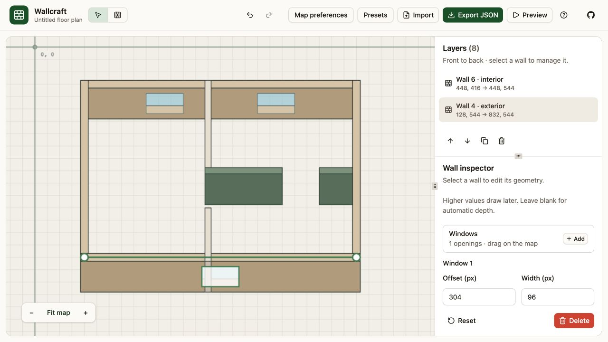
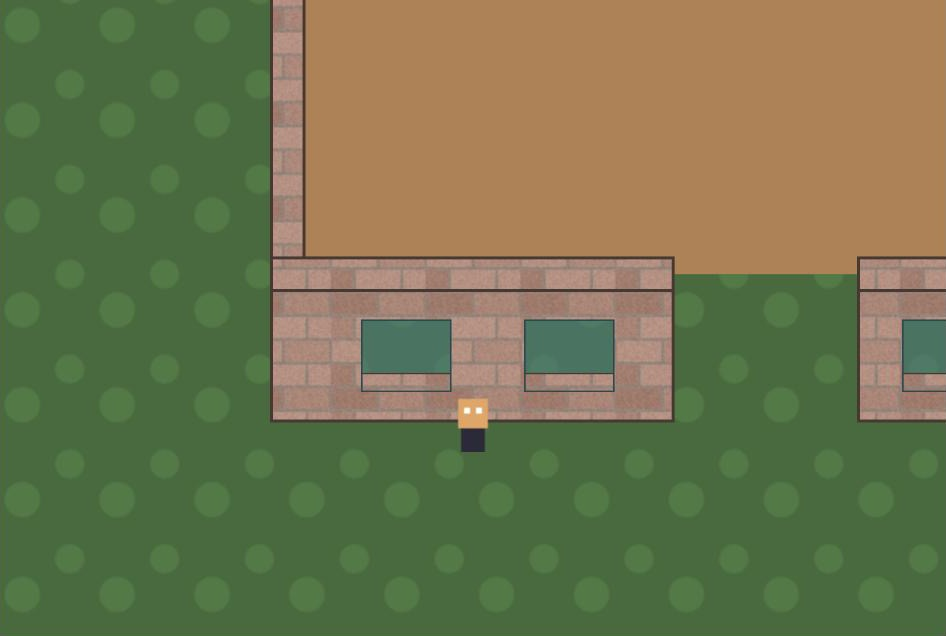
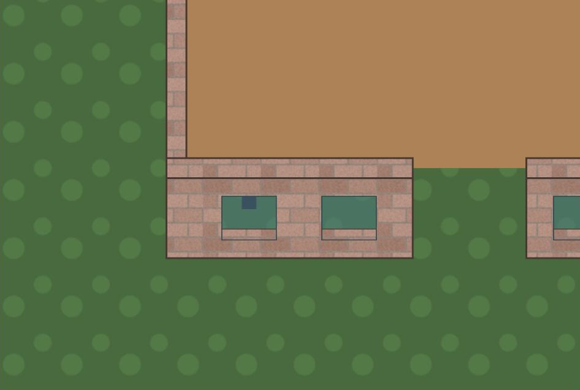

# @mertdogar/phaser-procedural-walls

A Phaser 4 scene plugin that draws top-down floorplan walls from a few lines of data. You describe wall centerlines and window positions; the plugin draws thick wall bodies, a front face, see-through windows with sills, and optional Arcade Physics colliders, and it depth-sorts each wall so characters walk in front of and behind walls correctly.



## Features

- Axis-aligned wall segments with automatic corner and T-junction filling
- Per-wall style presets: flat colors or tiled textures for the wall top and its face
- Windows cut into the face with translucent glass and an opaque sill
- One depth-sorted Container per wall; use `sprite.setDepth(sprite.y)` with automatic wall depths
- Optional Arcade static bodies matching each wall's bottom footprint
- Pure geometry module with unit tests, no Phaser needed to test it
- Embeddable `WallEditor` for drawing, selection, whole-wall movement, endpoint handles, and window dragging in an existing Phaser scene
- Wallcraft editor prototype: draw walls, drag endpoints and windows, edit height and drawing order, and manage presets
- Resizable layers and inspector panels with wall selection, duplication, deletion, and reordering
- Full-pane canvas with origin axes, two-finger scrolling to pan, and pinching to zoom
- Map preferences for applying height or thickness to all existing walls
- Upload tiled textures, export/import maps with embedded images, and test collisions in a playable preview

Custom wall drawing orders need matching character-depth handling in your game.
Wallcraft preview handles player occlusion against wall footprints, but this
editor-only logic is not included in JSON exports. See the
[depth convention](docs/api.md#depth-convention).

## Try Wallcraft

With Node 20 or newer, launch the packaged editor:

```bash
npx @mertdogar/phaser-procedural-walls@latest editor
# or
pnpx @mertdogar/phaser-procedural-walls@latest editor
```

This command requires a release that includes the editor CLI. This README and
its screenshots describe the current repository; the published npm release may
not include the latest editor and geometry changes. To use the repository version:

```bash
pnpm install
pnpm dev
```

Open the localhost URL printed in the terminal. The packaged editor selects an available port; append `--port 8080` to choose one. Draw a wall, switch to Select to edit it, or open **Presets** to change shared styles. **Preview** adds a character controlled with the arrow keys. Press Ctrl+C in the terminal to stop the server.

Wallcraft is an in-memory prototype, bundled alongside the Phaser library. Export your JSON before closing or reloading the page. See the [Wallcraft guide](docs/wallcraft.md) for editing, textures, and loading an exported map in a game.

## Install

```bash
pnpm add @mertdogar/phaser-procedural-walls phaser
```

Register the scene plugin in your game config:

```ts
import Phaser from "phaser";
import { WallMapPlugin } from "@mertdogar/phaser-procedural-walls";

new Phaser.Game({
  physics: { default: "arcade" },
  plugins: { scene: [{ key: "WallMapPlugin", plugin: WallMapPlugin, mapping: "wallMapPlugin" }] },
  scene: MyScene,
});
```

## Minimal example

```ts
const wallMap = this.add.wallMap({
  presets: {
    brick: { fill: 0xb59a8c, edge: 0x4a3830, lipHeight: 88, lipFill: 0x8f7a70, windowFill: 0x3b7d86 },
  },
  walls: [
    { x1: 0, y1: 0, x2: 400, y2: 0, thickness: 22, preset: "brick", windows: [{ offset: 60, width: 60 }] },
    { x1: 0, y1: 0, x2: 0, y2: 300, thickness: 22, preset: "brick" },
    { x1: 400, y1: 0, x2: 400, y2: 300, thickness: 22, preset: "brick" },
    { x1: 0, y1: 300, x2: 400, y2: 300, thickness: 22, preset: "brick", windows: [{ offset: 170, width: 60 }] },
  ],
  collide: true,
});

const player = this.physics.add.sprite(200, 150, "player").setOrigin(0.5, 1);
this.physics.add.collider(player, wallMap.bodies!);

// in update()
player.setDepth(player.y);
```

<p>
  
  
</p>

## Documentation

- [Quick start](docs/quickstart.md). Build a walkable room with a window from an empty folder.
- [Wallcraft guide](docs/wallcraft.md). Edit maps, manage presets and textures, test collisions, and export to Phaser.
- [API reference](docs/api.md). Every config field, preset option, and method.
- [How it works](docs/how-it-works.md). Corner filling, depth sorting, collision footprints, and window holes.

## Agent skill

The repository includes a portable
[procedural-walls skill](skills/phaser-procedural-walls/SKILL.md) for coding
agents. It covers library integration, Wallcraft exports, presets, textures,
depth sorting, and collisions, with self-contained references.

Install it from your project's root with the [skills CLI](https://skills.sh/docs):

```bash
npx skills add mertdogar/phaser-procedural-walls --skill phaser-procedural-walls
```

Append `--agent codex` to target Codex, or `--global` to install for your user
instead of the current project. The installation includes the bundled references.

To check available skills without installing:

```bash
npx skills add mertdogar/phaser-procedural-walls --list
```

Start a new agent session if needed, then ask, for example:
“Use the phaser-procedural-walls skill to load my Wallcraft export into a Phaser
scene with player collisions.” The skill is distributed in Git, not in the npm
package. Its bundled references track the repository, including changes made
after the original 0.2.0 release.

## 0.4.1 release notes

Drag a selected wall's green centerline to move the entire segment with a
grid-snapped preview. Endpoint resizing and window dragging remain available.
Hosts can cancel through `WallEditor.cancel()`; Wallcraft binds this to Escape.

## 0.4.0 release notes

Version 0.4.0 exports `WallEditor`, extracted from Wallcraft's canvas interactions.
Attach it to your existing Phaser scene to draw snapped walls, select walls,
drag endpoints, and move windows. Your application owns data, UI, rendering,
camera navigation, and accepting or refusing edits.

The standalone editor now uses this component. Open `/?embedded` in the demo
or packaged editor for a small Phaser-only example with property controls.
See the [embedding guide](docs/wallcraft.md#embed-the-wall-editor-in-your-game)
and [API reference](docs/api.md#walleditor). Existing renderer and geometry APIs
are unchanged.

## 0.3.0 release notes

Version 0.3.0 adds large-map navigation, resizable layers and inspector panels,
bulk height and thickness settings, window-width controls, and a Help dialog.
Select and Draw now live in the top bar. Preview handles player occlusion with
custom wall drawing orders. Documentation, screenshots, and the repository's
installable agent skill have also been updated.

### Upgrade from 0.2.0

Review existing maps before upgrading your game:

- **Collision footprints changed.** Colliders now match the wall body's bottom
  footprint, shifted south by its effective face height. Recheck spawn points,
  wall junctions, and doorways. Use matching face heights around aligned gaps.
- **Default window sills changed.** When `sillHeight` is omitted, it follows wall
  thickness, clipped to the opening height. Explicit values remain unchanged;
  set a value to preserve an older look, or use zero to disable sills.
- **Preview sorting is editor-only.** Exported custom `depth` values remain
  absolute drawing orders. Consumer games still need character sorting that
  accounts for these values; `setDepth(player.y)` assumes automatic wall depths.

Launch this specific version with
`npx @mertdogar/phaser-procedural-walls@0.3.0 editor` or
`pnpx @mertdogar/phaser-procedural-walls@0.3.0 editor`.

## Develop

```bash
pnpm install
pnpm dev     # wall editor prototype: draw walls and import/export WallMapConfig JSON
pnpm test    # geometry and editor interaction tests
pnpm typecheck
pnpm lint
pnpm build   # library in dist/ and bundled app in dist/editor/
pnpm editor  # serve the built app locally
pnpm test:cli # launcher integration tests (run after build)
```

## License

MIT
