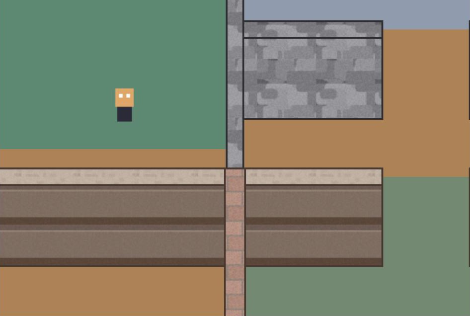
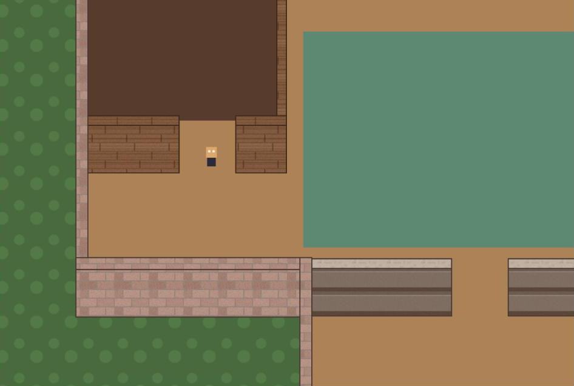
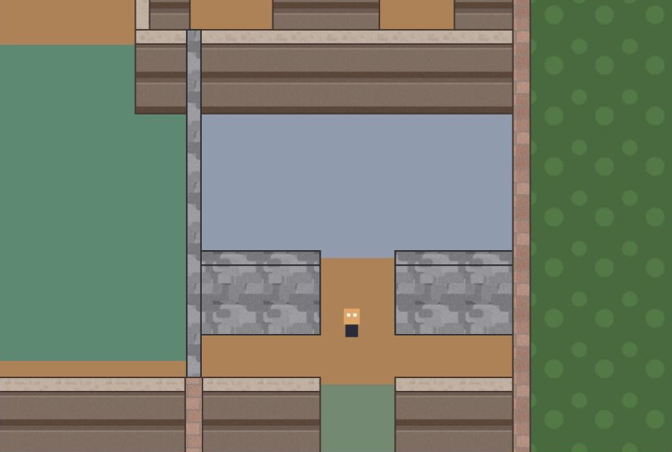

# How it works

This page explains the decisions behind the plugin so you can predict what it will draw and why. It is background reading, not a set of steps.

## The wall model

A wall is a centerline segment plus a thickness. The renderer turns that into two rectangles: the **body**, which is the wall top seen from above, and the **lip**, a face drawn directly below the body. The lip is what makes a wall read as tall in a top-down view. It is purely cosmetic in world space: it does not shift the wall, it hangs south of it.

Only axis-aligned walls are supported. That keeps every shape a rectangle, which is what makes the rest of this page short.

## Corners and T-junctions

You author endpoints on the centerline, so two walls meeting at a corner would leave a notch the size of half a thickness. The plugin fixes this by extension: for each endpoint of a wall, it looks for any other wall whose centerline passes through that point, including its interior. If it finds one, the endpoint is pushed outward by half of that wall's thickness.

At an L corner both walls extend and overlap. At a T-junction only the stem extends, into the bar. Since bodies are drawn before strokes within each wall, and each wall is its own object, you will see one wall's outline cross the other at a junction. That seam was accepted in exchange for per-wall depth sorting, described next.

## Depth sorting

Each wall is a separate Container with `depth` set to its **south edge**, the bottom of the lip. Characters set `depth` to their feet y. That single rule produces the two cases you expect:

A character south of the wall has feet y greater than the wall's depth, so it draws on top, standing against the face.

A character north of the south edge draws underneath. This includes a character standing inside the wall zone, which is possible because of how collision works.

Vertical walls use the same rule with their bottom end as the south edge. A character walking alongside a vertical wall never overlaps it, so the sort order there rarely matters.

A single Container for the whole map cannot do this, since one depth value cannot be both above and below the player. That is why the plugin returns a handle over many containers instead of one Game Object.

## Collision

When `collide` is on, horizontal walls get a static body that is only 8 px tall, placed along the bottom of the lip. Vertical walls get their full rectangle.

The thin plane is deliberate. From outside, a character pushing north stops at the bottom of the face and is drawn in front of it. From inside, a character walking south passes over the wall top, is hidden by the wall, and stops at the same plane. Both characters end up at the same world y with the same depth rule and the correct draw order. A full-height collider would stop the inside character at the wall top, and the character would never be behind anything.

The `collider` rectangle is computed in the geometry module, so you can read it from `resolveWalls` if you use a physics engine other than Arcade.

## Windows

Windows on a wall with a lip are cut into the face; walls without a lip, and vertical walls, put the window into the body instead. A window is a real hole: the face is drawn as up to four tiled pieces around each window, and a translucent glass rectangle is painted over the gap. Anything drawn beneath the wall shows through with the glass tint. This is why the character behind the wall is visible in the window above.

A **sill** is drawn at the bottom of each face window, using the body fill or texture. It is opaque, sits above the glass, and gives the window a horizontal surface to sit on. Window coordinates are rounded to whole pixels so the tiled pieces meet without visible seams.

## Textures

A preset may name a `texture` for the body and a `lipTexture` for the face. Textured rectangles are drawn with TileSprites whose tile position is set to the rectangle's world position, so a texture stays aligned across the pieces of one wall and across neighbouring walls. Untextured rectangles go into a single Graphics object per wall.

The demo generates its brick, stone, plank, plaster, and panel textures on a canvas at startup. Any loaded image works the same way as long as it tiles.

## What the plugin does not do

- Doors. Leave a gap between two wall segments instead.
- Diagonal walls or curved walls.
- Incremental updates. Changing anything rebuilds every wall.
- Tracking character depth. One line in your update loop does that.
