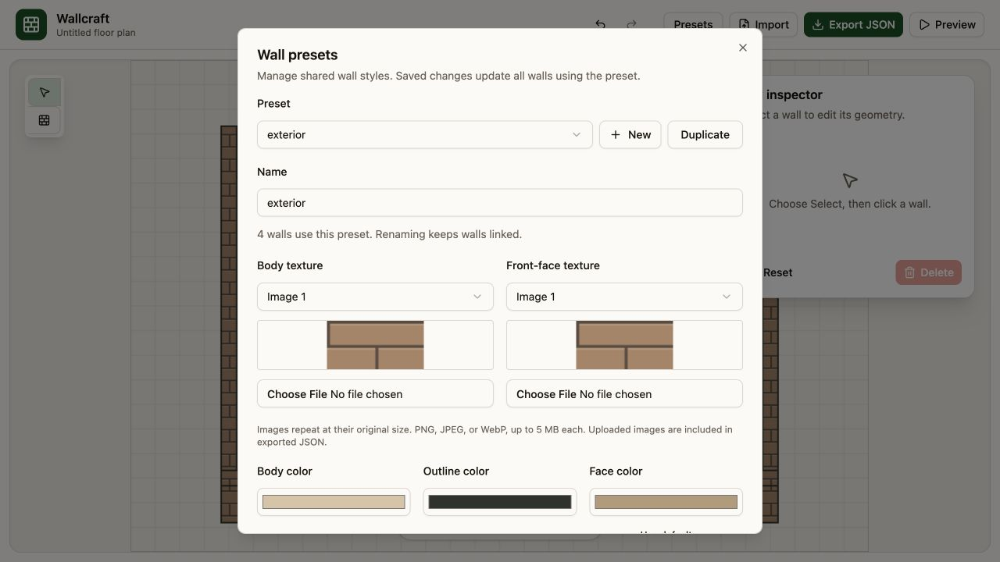
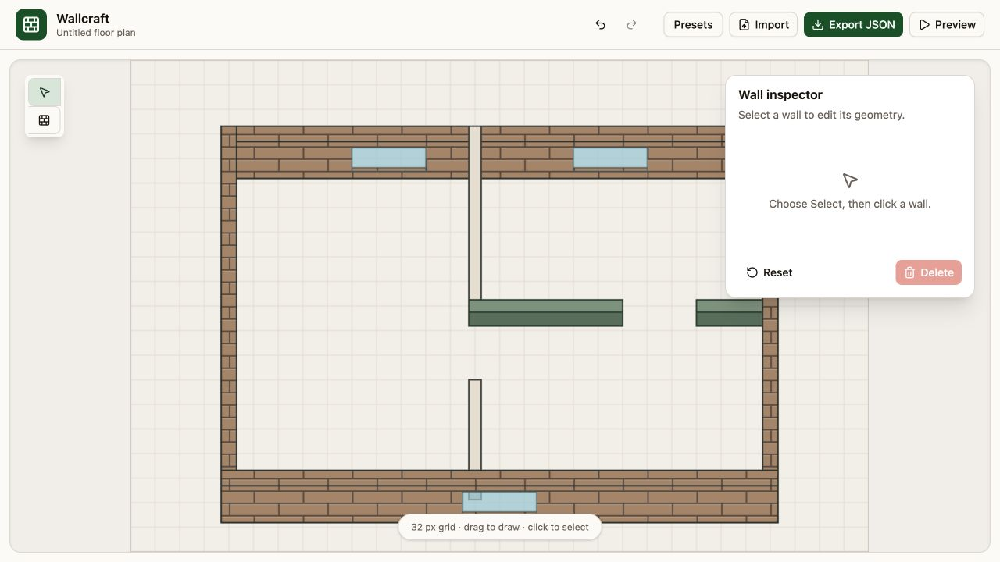
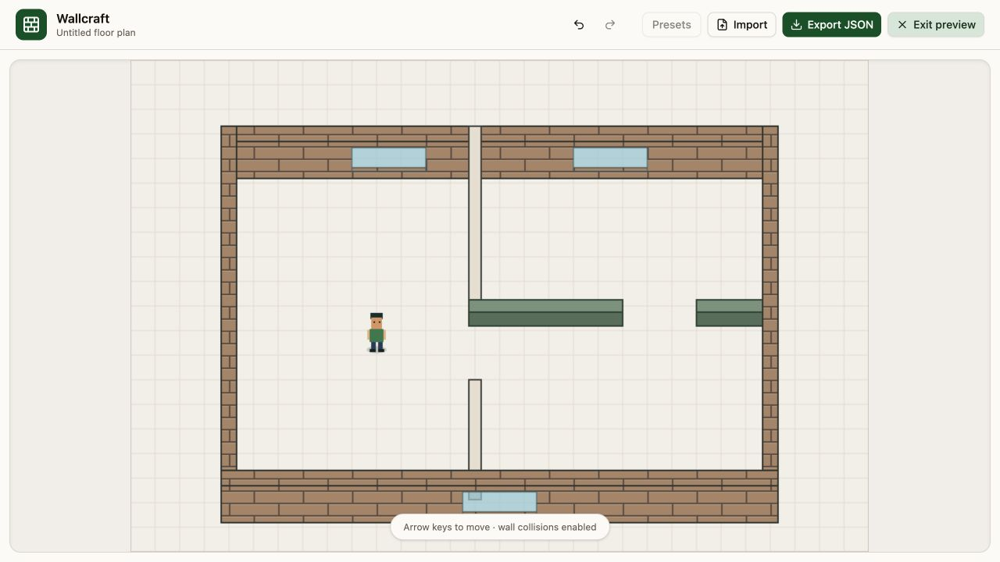

# Use Wallcraft

Wallcraft is the repository's React, Vite, shadcn, and Phaser editor prototype. Use it to build an axis-aligned wall map and try it with a character before exporting it to your game.

## Start the editor

With Node 20 or newer, run:

```bash
npx @mertdogar/phaser-procedural-walls@latest editor
# or
pnpx @mertdogar/phaser-procedural-walls@latest editor
```

The package version must include the editor CLI. It serves a prebuilt app; no repository checkout or Vite development server is needed. Open the printed `http://127.0.0.1:PORT/` URL. The server listens only on your computer and chooses an available port by default.

To choose a port or see help:

```bash
npx @mertdogar/phaser-procedural-walls@latest editor --port 8080
npx @mertdogar/phaser-procedural-walls@latest --help
```

If a chosen port is occupied, choose another or omit `--port`. Press Ctrl+C to stop. The launcher serves only the bundled app, not files from your working directory. Maps stay in browser memory; use Export JSON to keep them.

### Run from source

For development, run these commands from the repository root:

```bash
pnpm install
pnpm dev
```

Open the local URL Vite prints. The editor starts with a sample floor plan. Changes live in memory: export before closing or reloading.

`pnpm build` builds the plugin library into `dist/` and the standalone editor into `dist/editor/`. Run `pnpm editor` to serve that build, or `pnpm editor --port 8080` to choose a port. Run `pnpm test:cli` after building to test the launcher. Rebuild after editing source files when using the packaged launcher.

## Draw and edit walls

1. Choose the wall tool on the left and drag on the map. Drawing snaps to a 32 px grid and locks to a horizontal or vertical line.
2. Choose the pointer tool and click a wall. Its endpoints and inspector appear.
3. Drag either circular endpoint to resize the wall. The opposite endpoint stays fixed, and the segment stays axis-aligned.
4. Use **X1**, **Y1**, **X2**, and **Y2** for numeric coordinates. Keep either X1 = X2 or Y1 = Y2; diagonal walls are unsupported.
5. Set **Thickness** for body width and **Height** for the visible face. An edited height overrides the preset for that wall.
6. Use **Drawing order** to resolve overlapping segments. Higher values render later. Clear it for automatic sorting.


New walls use `interior` when that preset exists, otherwise the first available preset. Choose a different preset in the selected wall's inspector. **Delete** removes the selected wall; **Reset** restores the entire sample map, including its presets.

Undo/redo covers adding or deleting walls, reset, imports, and saved preset changes. Direct inspector edits and dragging are not currently recorded in that history. Export checkpoints before extensive editing.

## Position windows

Select a wall and click **Add** in its Windows section. Drag a window along the selected wall, or enter its offset in the inspector. Dragging snaps to the grid; the offset measures from the wall's first authored endpoint to the near edge of the opening.

Window width is currently edited through JSON. Windows are visual openings and do not create walkable gaps. For a doorway, leave space between two wall segments.

## Manage shared presets

Open **Presets** in the top bar, then select a style.

- **New** creates a preset with the default interior style.
- **Duplicate** copies the selected saved preset.
- Edit the name, colors, face height, outline width, glass opacity, inset, or sill height, then click **Save preset**.
- Renaming keeps all linked walls assigned to the renamed preset.
- Delete is available only when no walls use the preset and at least one other preset remains.

Edits apply on save. Switching presets or closing the manager discards unsaved form edits. Individual wall height overrides remain in effect after changing a preset's face height. To inherit the preset again, remove that wall's `height` field in JSON and reimport.



## Assign images to a preset

1. In **Presets**, choose the style to edit.
2. Upload an image under **Body texture** or **Front-face texture**. PNG, JPEG, and WebP files up to 5 MB are supported.
3. Use the selectors to reuse an uploaded image on another surface or preset. A thumbnail previews the selected image.
4. Click **Save preset**, then close the manager to inspect the map.

Images tile at their original pixel size. Use a small seamless texture for repeating material; a full character sprite or spritesheet will repeat as a whole image. There are no frame-selection, animation, or texture-scale controls. Choose **Solid color** to remove an assignment. Uploaded images remain available for reuse and are embedded in exported JSON.



## Test movement and collisions

Click **Preview** next to Export JSON. The editing tools hide and a character appears. Use the arrow keys to move; diagonal movement is normalized and walls block the character. Click the canvas if it needs keyboard focus. Click **Exit preview** to resume editing.



Preview enables collision even if the imported map has `collide: false`; it does not change that exported setting. Check wall junctions, doorway gaps, window visibility, and any manual drawing-order values.

## Save and load maps

**Export JSON** downloads `wall-map.json`. **Import** accepts a JSON file or pasted text; the text box initially contains the current map, which is also useful for inspecting its data. Click **Import map** to apply it.

Exports contain `walls`, `presets`, optional `collide`, and optional `textures`. Texture values are embedded image data URLs, so the map can be reimported into Wallcraft without the original image files. External Phaser texture keys without embedded images must be replaced with an upload or Solid color in this editor.

## Load an exported map in Phaser

Place the exported file at `public/wall-map.json` in your Vite game. Register `WallMapPlugin` as shown in the [quick start](quickstart.md). Then load the JSON, queue its images during `preload`, and create the walls in `create`:

```ts
import Phaser from "phaser";
import type { WallMapConfig } from "@mertdogar/phaser-procedural-walls";

type EditorMap = WallMapConfig & { textures?: Record<string, string> };

class Office extends Phaser.Scene {
  preload() {
    this.load.once("filecomplete-json-office-map", (_key: string, _type: string, map: EditorMap) => {
      for (const [key, dataUrl] of Object.entries(map.textures ?? {})) {
        this.load.image(key, dataUrl);
      }
    });
    this.load.json("office-map", "/wall-map.json");
  }

  create() {
    const map = this.cache.json.get("office-map") as EditorMap;
    const walls = this.add.wallMap(map);
    // Connect your character to walls.bodies when map.collide is true.
  }
}
```

The Phaser loader finishes the queued images before `create` runs. The library ignores the editor's `textures` field; its preset texture keys resolve against Phaser's Texture Manager. Your character still needs a collider and `setDepth(player.y)` each frame; see the [quick start](quickstart.md#4-add-a-character).
